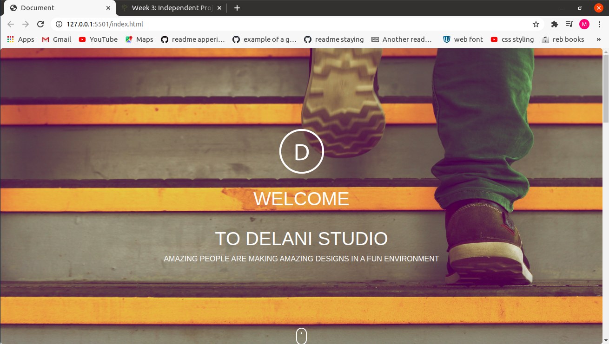

# DELANI STUDIO
---
Here is the link to the Delani studio webage:https://mugisha-thierry.github.io/Delani/
---
---
## PROJECT DISCRIPTION
---

This website shows what product are offered by Delani studio and the technology that they use.
It also provides the form to fill in case you want to reach to them or give them opinions.
You are all welcome.

## AUTHOR
---
MUGISHA THIERRY
A STUDENT FROM MORINGA SCHOOL RWANDA 
---
### SETUP
---
Fork this repository after clone this repository to go on your local git and after open it in your vscode and make same changes.
--- 
## BDD (Behaviour, Driven,Development)
---
ACTION  | OUTCOME|
|-------|--------|
|click design icon | You will see a small paragraph showing what the studio those|
|click development icon| You will see a smaill paragraph showing the type of project developed by Delani studio.|
|click product icon(vice-versa)| You will see a smaill paragraph showing what product that the studio offers|
|Hover on each image| You will see the image name|
|Fill the contact us form and click submit| You will see an alert message telling you that your form was submitted.|
### TECHNOLOGY USED
---
- HTML
- CSS
- JAVASCRIPT
- Jquerry
---
### CONTACT INFORMATION
---
- INSTAGRAM: [mugisha_thierry_rwanda](https://www.instagram.com)
- FACEBOOK: [Mugisha Thierry](https://www.facebook.com)
- EMAIL: [thierrymugis@gmail.com](https://www.gmail.com)
---
#### COPY RIGHT AND LICENSE
---
MIT License

Copyright (c) 2019 John Mutavi

Permission is hereby granted, free of charge, to any person obtaining a copy
of this software and associated documentation files (the "Software"), to deal
in the Software without restriction, including without limitation the rights
to use, copy, modify, merge, publish, distribute, sublicense, and/or sell
copies of the Software, and to permit persons to whom the Software is
furnished to do so, subject to the following conditions:

The above copyright notice and this permission notice shall be included in all
copies or substantial portions of the Software.

THE SOFTWARE IS PROVIDED "AS IS", WITHOUT WARRANTY OF ANY KIND, EXPRESS OR
IMPLIED, INCLUDING BUT NOT LIMITED TO THE WARRANTIES OF MERCHANTABILITY,
FITNESS FOR A PARTICULAR PURPOSE AND NONINFRINGEMENT. IN NO EVENT SHALL THE
AUTHORS OR COPYRIGHT HOLDERS BE LIABLE FOR ANY CLAIM, DAMAGES OR OTHER
LIABILITY, WHETHER IN AN ACTION OF CONTRACT, TORT OR OTHERWISE, ARISING FROM,
OUT OF OR IN CONNECTION WITH THE SOFTWARE OR THE USE OR OTHER DEALINGS IN THE
SOFTWARE.
----